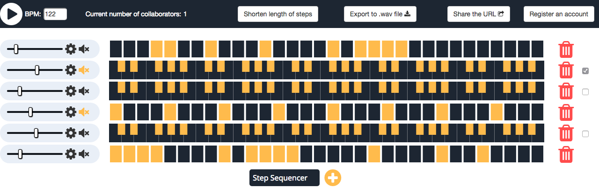

# RTMC
### What is Real-Time Music Collaborator about?

##### Real-Time Music Collaborator is a platform which allows you and your friends make songs together in real-time!

##### Share the URL to a friend and see each others changes appear on your screen as they happen!

### Try it out for real [here!](http://137.74.165.127:3000/)

**Prerequisite - Please use Google Chrome Canary browser for the MIDI capabilities!**

- Features a step-sequencer with a huge amount of samples to click and create patterns and MIDI capabilities to record melodies over the top!

- Sample sound parameters are editable with EQ-3 and waveform selector

- MIDI synthesiser has two editable ocsillators and once melody is recorded you can edit the waveform it creates

- Manage your created tracks in your user portal

